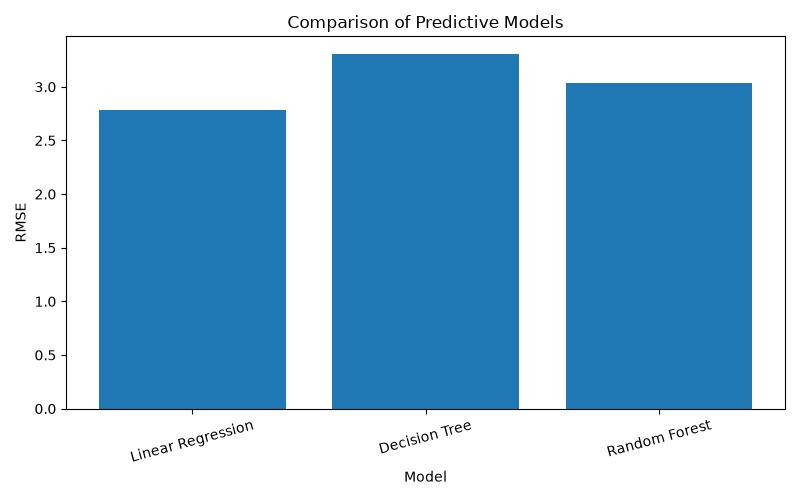

# Week 4 – Predictive Modelling and Optimisation in Logistics Systems

## Project Overview

This project was completed as part of the YUVA Internship Week 4 task on Predictive Modelling and Optimisation in Logistics Systems.

The objective of the project is to apply machine learning techniques to a logistics and supply-chain dataset to predict shipping time and develop optimisation strategies for improving logistics operations.

## Problem Statement

Shipping time is an important logistics performance metric. Longer shipping times can affect customer satisfaction, inventory availability, production planning, and transportation scheduling.

In this project, machine learning models are used to predict shipping time based on selected supply-chain variables.

## Dataset

The dataset contains supply-chain information including variables related to:

- Shipping costs
- Lead time
- Manufacturing lead time
- Order quantities
- Stock levels
- Production volumes
- Defect rates
- Shipping times

## Features Used

The following variables were selected as predictors:

- Shipping costs
- Lead time
- Manufacturing lead time
- Order quantities
- Stock levels
- Production volumes
- Defect rates

### Target Variable

**Shipping times**

## Machine Learning Models

Three regression models were implemented and compared:

1. Linear Regression
2. Decision Tree Regression
3. Random Forest Regression

## Model Evaluation

The models were evaluated using:

- Mean Absolute Error (MAE)
- Root Mean Squared Error (RMSE)
- R-squared (R²)

### Results

| Model | MAE | RMSE | R² |
|---|---:|---:|---:|
| Linear Regression | 2.456 | 2.786 | -0.250 |
| Decision Tree | 2.559 | 3.305 | -0.759 |
| Random Forest | 2.560 | 3.031 | -0.480 |

Based on RMSE, Linear Regression performed best among the three models on the test dataset.

Five-fold cross-validation was also performed for the Random Forest model, producing an average RMSE of approximately 3.210.

## Visualization

The project includes a comparison of the predictive models based on RMSE.

## Optimisation Strategy

The predictions can be used to identify shipments with potentially higher shipping times.

Possible optimisation strategies include:

- Prioritising high-risk shipments
- Improving dispatch planning
- Reviewing transportation options
- Using additional time buffers for high-risk shipments
- Monitoring inventory when predicted shipping time is high
- Comparing predicted and actual shipping times
- Improving route and carrier selection using additional historical data

## Tools and Technologies

- Python
- Pandas
- NumPy
- Scikit-learn
- Matplotlib
- Microsoft Word
- GitHub

## Conclusion

This project demonstrates how predictive analytics can be applied to logistics operations. By forecasting shipping time and identifying potentially high-risk shipments, logistics teams can make better decisions regarding dispatch planning, transportation, inventory, and operational resource allocation.

The current analysis provides a foundation for future improvements using larger historical datasets and additional variables such as carrier, route, transportation mode, location, traffic conditions, weather, and vehicle information.
